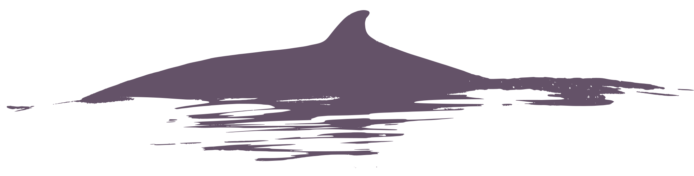

[williamcioffi.github.io/](https://williamcioffi.github.io/)

### pages
- [keratin archives](https://williamcioffi.github.io/keras)
	biomolecules in baleen.
- [sattag supplement](https://williamcioffi.github.io/sattag_supplement_pub)
	some notes on Wildlife Computers (mostly SPLASH10) satellite tags and closely related topics
- [horrible R mistakes](https://github.com/williamcioffi/horrible_r_mistakes) a collection of mistakes in R from which to learn. Contributions welcome!

### software
- [sattagutils](https://github.com/williamcioffi/sattagutils)
	an R package for handling data from Wildlife Computers satallite tags (mostly SPLASH10).
- [monitorgonio](https://github.com/williamcioffi/monitorgonio)
	an R package containing a shiny app to display Argos Goniometer output in the field.
- [parsegonio](https://github.com/williamcioffi/parsegonio)
	an R function for parsing Argos Goniometer recieved mesages form Wildlife Computers satallite tags.

### artwork
- [tag and ziphius svgs](https://github.com/williamcioffi/zc_tag_sketches)

### contact
William R. Cioffi 
135 Duke Marine Lab Rd 
Beaufort, NC 28516, USA 

wrc14 [at] duke.edu 
[orcid.org/0000-0003-1182-8578](https://orcid.org/0000-0003-1182-8578) 
[google scholar](https://scholar.google.com/citations?user=dIR3B28AAAAJ&hl=en&oi=sra)

